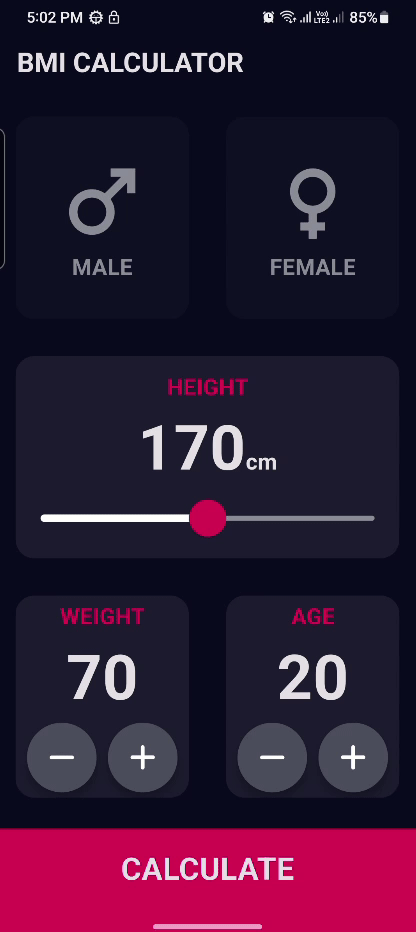

# BMI Calculator App

A simple BMI (Body Mass Index) Calculator app built with Flutter.

## Overview

The BMI Calculator app allows users to calculate their Body Mass Index (BMI) by entering their weight and height. The app then calculates the BMI and provides a classification based on the result, indicating whether the user is underweight, normal weight, overweight, or obese.

## Screenshots



## Installation

To run the app locally, follow these steps:

1. Clone this repository:

   ```
   git clone (https://github.com/Al-Mansori/BMI-Calculator-App.git)
   ```

2. Navigate to the project directory:

   ```
   cd BMI-Calculator-App
   ```

3. Get all the remaining Files:

   ```
   flutter create BMI-Calculator-App
   ```


4. Run the app on your preferred device:

   ```
   flutter run
   ```

